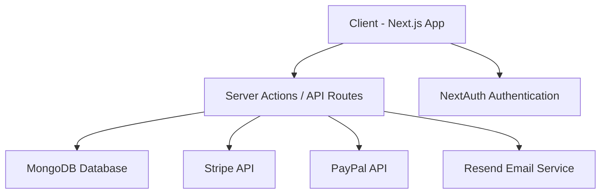

# 🛒 E-Commerce Web Application

A production-ready, full‑stack e-commerce platform built with modern technologies and best practices. The application focuses on scalability, performance, clean architecture, and an excellent user experience across devices.

---

## 🚀 Key Features

### 🛍️ Customer Experience

- 🔎 **Advanced Product Search** — Fast, optimized search with relevant results
- 🎯 **Filtering & Sorting** — Filter by category, price, rating, and more
- ⭐ **Ratings & Reviews** — Users can rate and review products
- 🌙 **Dark Mode & Theme Colors** — Dynamic theme switching with customizable UI colors
- 🌍 **Multi-language Support (i18n)** — Global-ready localization system
- 🛒 **Cart Management** — Persistent cart with real-time updates
- 💳 **Secure Checkout** — Integrated payments with PayPal & Stripe
- 📦 **Order Tracking** — View order history and delivery status
- 🔔 **Notifications System** — Real-time feedback (success, error, updates)

---

### 🧑‍💼 Admin Dashboard

- 📊 **Analytics Dashboard** — Visual insights using charts
- 📈 **Sales & Performance Metrics** — Track revenue and trends
- 📦 **Product Management** — Create, update, and delete products
- 👥 **User Management** — Manage users and roles
- 🧾 **Order Management** — Control order lifecycle
- ⭐ **Review Moderation** — Approve or remove reviews

---

## 🧰 Tech Stack

### ⚛️ Frontend

- **Next.js (App Router)** — SSR, routing, and server actions
- **React.js + TypeScript** — Type-safe UI development
- **shadcn/ui** — Accessible and modern UI components
- **Tailwind CSS** — Utility-first styling system
- **Zustand** — Lightweight state management

### 🧠 Backend

- **Node.js** — Server-side runtime
- **MongoDB** — NoSQL database for scalability
- **Server Actions / API Routes** — Business logic handling

### 🔐 Authentication & Validation

- **NextAuth.js** — Secure authentication system
- **Zod** — Schema validation
- **React Hook Form** — Efficient form management

### 💳 Payments & Communication

- **Stripe** — Card payments
- **PayPal** — Alternative payment method
- **Resend** — Email confirmations & notifications

---

## ⚙️ Installation & Setup

### 1️⃣ Clone the repository

```bash
git clone https://github.com/your-username/your-repo.git
cd your-repo
```

### 2️⃣ Install dependencies

```bash
npm install
```

### 3️⃣ Configure environment variables

Create a `.env.local` file in the root directory:

```env
# Database
MONGODB_URI=your_database_url

# Authentication
NEXTAUTH_SECRET=your_secret
NEXTAUTH_URL=http://localhost:3000

# PayPal
NEXT_PUBLIC_PAYPAL_CLIENT_ID=your_paypal_client_id

# Stripe
STRIPE_SECRET_KEY=your_stripe_secret
NEXT_PUBLIC_STRIPE_PUBLISHABLE_KEY=your_stripe_public

# Email (Resend)
RESEND_API_KEY=your_resend_key
```

---

### 4️⃣ Run the development server

```bash
npm run dev
```

App will be available at:

```
http://localhost:3000
```

---

## 🏗️ Project Structure

```
/app            → App Router pages & layouts
/components     → Reusable UI components
/lib            → Utilities, DB, API logic
/hooks          → Custom React hooks
/store          → Zustand state management
/types          → TypeScript types
/styles         → Global styles
```

---

## 🎨 UI & Theming

- Supports **light/dark mode**
- Custom **theme color system**
- Built using **shadcn/ui** + Tailwind

---

## 📊 Admin Analytics

- Interactive charts for sales & performance
- Data visualization for better decision making
- Clean dashboard UI for admins

---

## 🔔 Notifications System

- Toast notifications for user actions
- Real-time feedback on operations (orders, payments, errors)

---

## 🔐 Authentication

- Secure login/signup with NextAuth
- Session management
- Protected routes for admin/user roles

---

## ✉️ Email System

- Order confirmations via Resend
- Transactional emails for users

---

## 📈 Future Enhancements

- 📱 Mobile application (React Native)
- 🤖 AI-based product recommendations
- 🌐 Advanced SEO optimization
- 📦 Inventory forecasting system

---

## 🤝 Contributing

Contributions are welcome!

1. Fork the repository
2. Create a new branch (`feature/your-feature`)
3. Commit your changes
4. Push to your branch
5. Open a Pull Request

---

## 👨‍💻 Author

**Ahmed Sokkar**
Frontend Developer (React / Next.js)

---

## ⭐ Support

If you find this project helpful, please give it a ⭐ on GitHub!

---

## 🌐 Live Demo

🔗 **Live App:** [https://nextjs-sokecommerce.vercel.app]
📂 **Repository:** [https://github.com/Ahmed-Sokar2020/Nextjs-SOKecommerce]

---

## 📸 Screenshots

> ⚠️ Replace these with real screenshots of your project

### 🏠 Home Page


### 🛍️ Product Page


### 🛒 Cart & Checkout


### 📊 Admin Dashboard


---

## 🎥 Demo Video

> Add a Loom / YouTube demo here

```
https://www.youtube.com/watch?v=your-demo-video
```

---

## 🧱 System Architecture



---

## ⚡ Performance & Best Practices

- ✅ Server-Side Rendering (SSR)
- ✅ Optimized data fetching
- ✅ Code splitting & lazy loading
- ✅ Form validation with Zod
- ✅ Secure authentication & protected routes

---

## 📌 Notes for Reviewers

- This project follows **clean architecture principles**
- Focused on **real-world scalability**
- Built to simulate a **production-grade e-commerce system**

---
